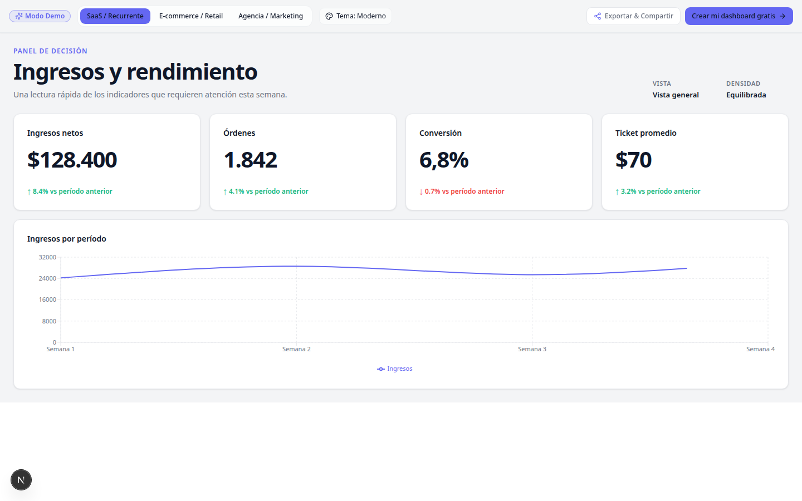

# dash-bi

> **Open-source & self-hosted AI-first Business Intelligence platform.**  
> Compose dashboards with natural language, query your data in conversational language, connect multiple sources, and choose your preferred LLM provider.

[](https://www.gnu.org/licenses/agpl-3.0)
[](https://nextjs.org)
[](https://react.dev)
[](https://www.typescriptlang.org)
[](./app/tests)
[](./docs/security/threat-model.md)
[](./CONTRIBUTING.md)

<p align="center">
  
</p>

---

## ⚡ ¿Por qué dash-bi?

Las herramientas tradicionales de BI (Metabase, Superset, Tableau) fueron construidas antes de la era de los Modelos de Lenguaje. Las herramientas modernas a menudo te obligan a usar su nube cerrada o te atan a un único modelo de IA propietario.

**dash-bi** es una plataforma de analítica y BI diseñada desde cero con **IA generativa, multi-LLM y soberanía de datos**:

- 🤖 **Generación de Dashboards con IA**: Escribe un prompt y obtén un dashboard completo con layouts variados (8 archetypes, 7 patrones atómicos), widgets configurados y queries SQL optimizadas.
- 💬 **NLQA ("Pregúntale a tus datos")**: Haz preguntas en lenguaje natural ("¿Cuál fue el MRR de julio por región?"), obtén la query ejecutada, explicación y gráfico interactivo, y guárdalo como widget en 1 clic.
- 🔑 **Multi-LLM & BYOK**: Usa OpenAI, Anthropic (Claude) o Google (Gemini) con tus propias API keys cifradas en reposo con AES-256-GCM.
- 🛡️ **Seguridad Grado Enterprise**: Aislamiento multi-tenant estricto mediante **PostgreSQL Row Level Security (RLS)** nativo, 5 capas de defensa contra SQL injection y usuario de base de datos de solo lectura.
- 🔌 **6 Conectores Nativos**: PostgreSQL, MySQL, Stripe, Google Sheets, Shopify y archivos locales (CSV / Excel).
- 🔔 **Alertas y Notificaciones**: Monitorea métricas y recibe avisos inmediatos en Slack, Email o Webhooks personalizados cuando se crucen umbrales críticos o falle la llegada de datos.
- 📅 **Reportes Programados & PDF Worker**: Generación automática de PDFs de alta fidelidad vía worker headless aislado con Puppeteer y envíos automáticos por correo.
- 🌐 **Embed Mode**: Embebe dashboards en cualquier SaaS externo vía `<iframe>` con tokens firmados HMAC y protección contra clickjacking (`Content-Security-Policy: frame-ancestors`).

---

## 📊 Comparativa

| Feature | Metabase OSS | Lightdash | Apache Superset | **dash-bi** |
| :--- | :---: | :---: | :---: | :---: |
| **Generación AI de Dashboards** | ❌ | ❌ | ❌ | **✅ Nativo (Multi-Archetype)** |
| **Multi-LLM Router (OpenAI/Anthropic/Gemini)** | ❌ | ❌ | ❌ | **✅ BYOK Cifrado** |
| **NLQA (Preguntas a Gráficos)** | Parcial | ❌ | ❌ | **✅ 1-clic a Widget** |
| **Aislamiento Multi-tenant Nativo** | Solo Enterprise | ❌ | Parcial | **✅ RLS en PostgreSQL** |
| **Editor Visual Drag & Drop** | Limitado | Limitado | Complejo | **✅ Fluido (`dnd-kit`)** |
| **Alertas multicanal (Slack, Email, Webhook)** | Email/Slack | Slack | Complejo | **✅ Sí, con cooldown y worker** |
| **Reportes PDF en Background Worker** | En proceso | ❌ | Vía Celery | **✅ Worker Puppeteer Aislado** |
| **Despliegue Rápido en Docker** | ✅ | ✅ | Complejo | **✅ 1 comando (`docker compose`)** |

---

## 🚀 Quickstart en 60 Segundos

La forma más rápida de levantar dash-bi con PostgreSQL 16, Redis 7, la aplicación Next.js y el worker de PDF:

```bash
# 1. Clonar el repositorio
git clone https://github.com/berriosb/dash-bi.git
cd dash-bi

# 2. Levantar todos los servicios con Docker Compose
docker compose up -d

# 3. Abrir en tu navegador
# -> http://localhost:3000
```

> 💡 **¿Quieres probar sin configurar bases de datos ni llaves de IA?**  
> Entra directamente a **`http://localhost:3000/demo/dashboard`** para interactuar con datos de prueba de 3 industrias (SaaS, E-commerce, Agencia B2B) y alternar temas en vivo.

---

## 🛠️ Desarrollo Local

Si prefieres correr la aplicación en modo desarrollo:

### Prerrequisitos
- Node.js 22+ (LTS)
- pnpm 9.12+
- Docker (para Postgres y Redis locales)

### Paso a paso

```bash
# 1. Instalar dependencias
cd app/
pnpm install

# 2. Configurar variables de entorno
cp .env.example .env.local

# 3. Levantar dependencias (Postgres 16 + Redis 7)
docker compose up -d postgres redis

# 4. Ejecutar migraciones y políticas RLS
pnpm db:migrate
pnpm db:setup-rls

# 5. Iniciar servidor de desarrollo
pnpm dev
```

La app estará disponible en `http://localhost:3000`.

---

## 🏗️ Arquitectura del Sistema

```
┌─────────────────────────────────────────────────────────────────────────┐
│ HOST (Docker Compose)                                                   │
│                                                                         │
│  ┌───────────────────────┐         ┌─────────────────────────────────┐  │
│  │   Next.js 16 App      │         │   PDF Worker (Puppeteer)        │  │
│  │   (Port 3000)         │         │   (Servicio Aislado)            │  │
│  │   - App Router / RSC  │         │   - Chrome Headless             │  │
│  │   - AI Gateway (v6)   │◄───────►│   - BullMQ Job Consumer         │  │
│  │   - Query Engine      │         │   - Generación de reportes PDF  │  │
│  │   - Studio (dnd-kit)  │         └────────────────┬────────────────┘  │
│  └───────────┬───────────┘                          │                   │
│              │                                      │                   │
│              ▼                                      ▼                   │
│  ┌───────────────────────┐         ┌─────────────────────────────────┐  │
│  │   PostgreSQL 16       │         │   Redis 7                       │  │
│  │   (Port 5432)         │         │   (Port 6379)                   │  │
│  │   - Multi-tenant RLS  │         │   - Cola de trabajos (BullMQ)   │  │
│  │   - Role Read-Only IA │         │   - Caché de consultas SQL      │  │
│  │   - Drizzle ORM       │         │   - Throttling & Rate limiting  │  │
│  └───────────────────────┘         └─────────────────────────────────┘  │
└─────────────────────────────────────────────────────────────────────────┘
```

### Seguridad y Threat Model (Defense in Depth)

1. **Aislamiento Multi-tenant Inviolable**: Toda consulta a base de datos se envuelve en `withOrgContext(orgId, userId, fn)`, seteando `app.current_org_id` en PostgreSQL y activando las políticas RLS.
2. **Validación de SQL Generado por IA**: Toda query generada pasa por `validateQuery()` que rechaza DDL/DML, inyecta automáticamente `LIMIT 5000` y bloquea tablas del sistema.
3. **Rol de Base de Datos de Solo Lectura**: Las consultas analíticas de la IA corren bajo el usuario `dashbi_readonly`, imposibilitando cualquier modificación accidental o maliciosa.
4. **Protección SSRF en Conectores**: Validación estricta de hosts y rangos IP privados antes de permitir conexiones a fuentes externas.
5. **BYOK Cifrado**: Claves de API de proveedores LLM cifradas con AES-256-GCM. Filtro automático de redaction en logger (Pino) para prevenir filtraciones en logs.

---

## 🧪 Calidad de Código & Testing

dash-bi cuenta con una suite completa de pruebas unitarias, de integración con PostgreSQL real y de seguridad estricta:

```bash
cd app/

# Ejecutar las 89 suites de prueba (714 tests)
pnpm test

# Verificación de tipos TypeScript en modo estricto
pnpm typecheck

# Linter estricto (cero warnings)
pnpm lint:strict

# Pruebas End-to-End con Playwright
pnpm test:e2e

# Verificar build de producción
pnpm build
```

---

## 📁 Estructura del Repositorio

```
dash-bi/
├── app/                            ← Código fuente de la aplicación
│   ├── src/app/                    ← Next.js App Router (Páginas y API routes)
│   ├── src/components/             ← NlqaPanel, Studio, Widgets, Alertas, UI
│   ├── src/db/                     ← Esquema Drizzle y políticas RLS
│   ├── src/lib/                    ← AI Gateway, Query Engine, Conectores, Cifrado
│   ├── src/worker/                 ← Worker de BullMQ para PDF y Alertas
│   ├── drizzle/migrations/         ← Migraciones SQL versionadas
│   └── tests/                      ← Tests unitarios, integración RLS y E2E
├── specs/                          ← 22 especificaciones detalladas de producto
├── docs/                           ← Arquitectura, modelo de amenazas y guías
├── docker-compose.yml              ← Topología de producción para despliegue
└── README.md                       ← Este archivo
```

---

## 📜 Licencia

Distribuido bajo licencia **AGPL v3** — consulta [`LICENSE`](./LICENSE) para más detalles.

dash-bi es 100% libre para self-hosting y uso interno en tu empresa. Si modificas dash-bi para ofrecerlo como un servicio SaaS comercial en la nube, debes compartir el código fuente de tus mejoras con la comunidad, garantizando la preservación del ecosistema abierto.

---

## 🤝 Contribuciones

¡Las contribuciones son bienvenidas! Consulta [`CONTRIBUTING.md`](./CONTRIBUTING.md) para conocer las pautas de estilo, flujo de branches (`feat/*`, `fix/*`) y conventional commits.
